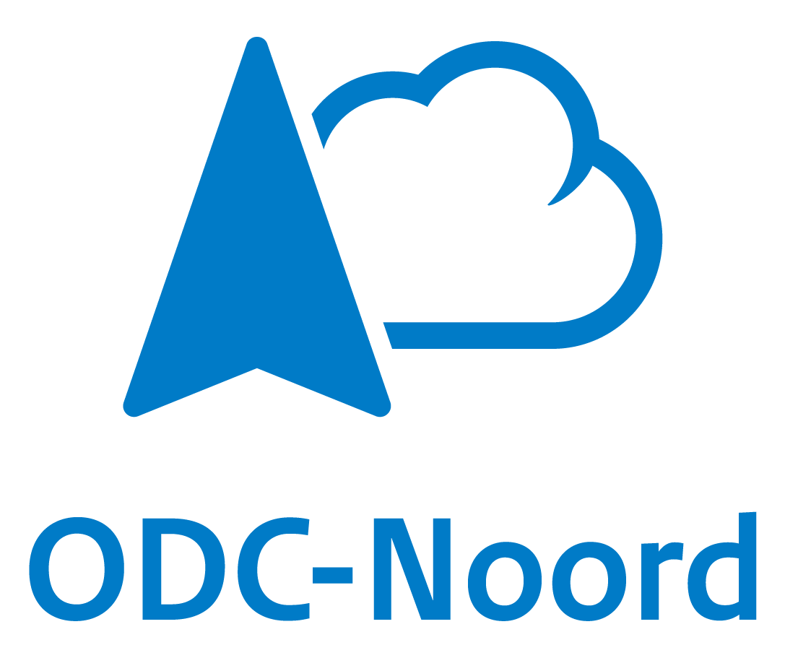

# Adopters

This is a list of companies that have adopted Capsule, feel free to open a Pull-Request to get yours listed.

[See all on the website](https://projectcapsule.dev/adopters/)

## Adopters list (alphabetically)

### [Bedag Informatik AG](https://www.bedag.ch/)

### [Department of Defense](https://www.defense.gov/)

### [Enreach](https://www.enreach.com/)

### [Fastweb](https://www.fastweb.it/)

### [Klarrio](https://klarrio.com/)

### [KubeRocketCI](https://docs.kuberocketci.io/)

### [ODC-Noord](https://odc-noord.nl/)

### [PITS Global Data Recovery Services](https://www.pitsdatarecovery.net)

### [Politecnico di Torino](https://www.polito.it/)

### [Reevo](https://www.reevo.it/)

### [Seeweb](https://seeweb.it/en)

### [University of Torino](https://www.unito.it)

### [Velocity](https://velocity.tech/)

### [Wargaming.net](https://www.wargaming.net/)

