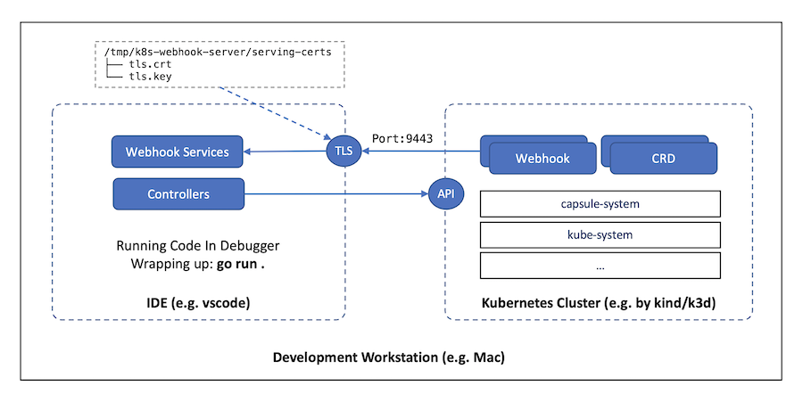

# Development

Our Makefile helps you with the development of new changes or fixes. [You may have a look at it](./Makefile), since not all targets are documented.

To execute your changes locally, you can run the binary locally. This will run just the capsule controller. We recommend [to setup a development environment](#development-environment) for a better development experience:

```bash
make run
```
## Building

You can build the docker image locally, Ko will be installed via go, so you don't need to install it manually.

```bash
make ko-build-all
```

This will push the build to your local docker images.

## Test

Execute unit testing:

```bash
helm dependency build charts/capsule
make test
```

Chart rendering unit tests require Helm on `PATH` and the chart dependencies above.

## E2E Test

**New changes always require dedicated E2E tests. E2E help us to ensure the quality of the code and it's functionality.**

For E2E test we use the [ginkgo](https://github.com/onsi/ginkgo) framework. You can see all the test under [e2e](./e2e/).


With the following command a new KinD cluster is created with the Kubernetes version `v1.20.7` (This can be done with any available Kubernetes version). A docker image is created and pushed and loaded into the KinD cluster. Then the E2E tests are executed against the KinD cluster.

```bash
make e2e/v1.20.7
```

You can also just run the e2e tests without the creation of a new kind cluster:

```
make e2e-exec
```

The E2E tests are also executed via the [github workflow](./.github/workflows/e2e.yaml) on every PR and push to the main branch.

# Development Environment

During development, we prefer that the code is running within our IDE locally, instead of running as the normal Pod(s) within the Kubernetes cluster.

Such a setup can be illustrated as below diagram:



## Setup Development Environment

To achieve that, there are some necessary steps we need to walk through, which have been made as a make target within our Makefile.

So the TL;DR answer is:

**Make sure a *KinD* cluster is running on your laptop, and then run `make dev-setup` to setup the dev environment.**. This is not done in the `make dev-setup` setup.

```bash
# Create a KinD cluster if not already created
$ make dev-cluster

# To retrieve your laptop's IP and execute `make dev-setup` to setup dev env
# For example: LAPTOP_HOST_IP=192.168.10.101 make dev-setup
$ LAPTOP_HOST_IP="<YOUR_LAPTOP_IP>" make dev-setup


# Monitoring Setup (Grafana/Prometheus/Pyroscope)
$ LAPTOP_HOST_IP="<YOUR_LAPTOP_IP>" make dev-setup-monitoring
```

### Tenant reconciliation diagnostics

Tenant reconciliation phase durations are exposed as
`capsule_tenant_reconcile_phase_duration_seconds`, with `phase` and `result`
(`success` or `error`) labels. For example, average phase duration over five minutes:

```promql
sum by (phase) (rate(capsule_tenant_reconcile_phase_duration_seconds_sum[5m]))
/
sum by (phase) (rate(capsule_tenant_reconcile_phase_duration_seconds_count[5m]))
```

Namespace cleanup runs in the separate `capsule/namespace-cleanup` controller,
with one worker and at most four resource types processed concurrently. Its
`namespace_cleanup` phase is separate from the Tenant reconciliation duration.
Cleanup waits until Pods are gone and the namespace has been terminating for at
least ten seconds. It verifies namespace identity and ownership using direct API
reads and protects object deletion and finalizer patches with preconditions.
Discovery selects resources advertising all four required verbs: `list`, `delete`,
`get`, and `patch`. Other APIs are left to their own lifecycle handling; `update`
does not substitute for finalizer patch support. Capsule's current and legacy
lifecycle finalizers on Capsule API resources are retained for their owning
controllers; this prevents namespace cleanup from abandoning resources outside
the terminating namespace. Other finalizers remain eligible for forced cleanup.
Namespace identity reads occur before DELETE/PATCH, not for already-terminating
objects that need no finalizer changes.

The chart's strict RBAC role (also enabled by the deprecated `minimal` option)
grants `get`, `list`, `watch`, `delete`, `deletecollection`, and `patch` across all
API groups and resources so cleanup can handle newly discovered custom APIs.
Kubernetes RBAC cannot limit `patch` to finalizers, terminating namespaces, or
namespaced resources: this grants cluster-wide access to all patchable fields.
The controller's namespace ownership and lifecycle checks constrain its cleanup
behavior; they do not narrow the RBAC grant. Resource creation and update may
still need explicit extra or aggregated permissions for features such as replication.

Namespace profiling and policy installation remain in the Tenant controller;
RoleBindings are installed before the custom resource usage recount.
Cleanup failures are logged and retried by `capsule/namespace-cleanup`; inspect
that controller's reconcile errors and queue metrics separately from
`capsule/tenants`.

Tenant admission installs the controller finalizer before the Tenant can acquire
namespaces. The controller also repairs active Tenants created before this
behavior was introduced. Namespace admission rejects new assignments until that
protection exists, and rejects assignments to terminating Tenants. These checks
reuse the existing authoritative Tenant read and add no admission API calls.
Updates to namespaces already owned by that Tenant can still complete cleanup.

During deletion, `status.spaces` is a work list, not proof that all owned
namespaces have been discovered. Once that list drains and child cleanup succeeds,
the controller checks namespace metadata directly against the API server before
releasing the finalizer. This check uses pages of at most 500 namespaces and
matches Tenant owner-reference UIDs, including namespaces without Tenant labels.
Discovered children return to the deletion work list. Active reconciliation and
repeated deletion reconciles waiting on known namespaces do not perform this
scan. The final check scales with the cluster's namespace count; namespace status,
labels, and an eventually consistent informer index cannot safely prove absence.

### Controller benchmarks

Run the reconciliation benchmarks with the Go toolchain declared in `go.mod`:

```bash
GOMAXPROCS=2 make bench-controllers > controllers.txt
# Quickly check every benchmark fixture and its assertions:
GOMAXPROCS=2 make bench-controllers BENCH_TIME=1x BENCH_COUNT=1
# Limit measurements to a controller:
GOMAXPROCS=2 make bench-controllers BENCH_FILTER='^BenchmarkControllerTenant/'
```

The adjacent `controller_bench_test.go` files cover all 27 controller entry
points. Each fixture warms reconciliation outside the timed loop, checks the
resulting resources or status, and varies namespace, tenant, rule, or resource
counts. Publication and permit preflight cases reset their input outside the
timed region on every iteration. Steady-state cases measure reconciliation of
already provisioned objects; they can still expose redundant writes.
The unit-test CI job executes each benchmark once with race detection to check
fixture correctness; it does not enforce machine-dependent timing thresholds.

| Benchmark | Controllers and workload |
| --- | --- |
| `Tenant` | Tenant profiling and RBAC; Tenant ResourceQuota updates; terminating namespace cleanup |
| `TenantOwner` | Indexed owner matching with matching and unrelated tenants |
| `RBAC` | ClusterRole and ClusterRoleBinding reconciliation with promoted ServiceAccounts |
| `Pod`, `ServiceMetadata`, `PersistentVolume` | Pod, Service, EndpointSlice metadata and PV tenant labels |
| `Configuration`, `CacheInvalidator` | Tenant/owner status aggregation and populated cache rebuilds |
| `RuleStatus` | Unchanged rules and publication after generation changes |
| `Admission` | Mutating and validating webhook configuration construction |
| `Replication` | GlobalTenantResource, TenantResource, and NamespaceWatcher applying resources with tenant isolation |
| `GlobalResourceQuota`, `CustomQuota` | Global ResourceQuota aggregation; namespaced and global CustomQuota usage |
| `ResourcePool` | ResourcePool allocation and ResourcePoolClaim assignment |
| `PermitTemplate`, `ResourcePermit` | Local/global template validation and selection; permit preflight and requested state |
| `TLS` | Valid certificate checks and webhook CA synchronization |

All benchmark names above have the `BenchmarkController` prefix. Results include
`ns/op`, `B/op`, `allocs/op`, and injected-client `GET/op`, `LIST/op`, and
`write/op` counts. Writes include status operations and dry-run requests.
Cleanup also reports dynamic-client LIST calls. Counters are shared by cached
and authoritative reader roles in these fixtures: they count method calls,
not network round trips.

These benchmarks measure controller work plus fake-client copying,
serialization, selection, and simulated apply. They exclude informer delivery,
queue delays, event delivery, client throttling, API-server latency, admission,
and etcd. Fake
client field selection does not model informer index complexity. Use the existing
scoped e2e/stress environment and controller-runtime metrics to validate
production latency, concurrency, and namespace recreation.

Compare repeated runs on the same machine, Go version, `GOMAXPROCS`, and workload;
keep both raw outputs and use `benchstat` to compare them. Use race detection for
fixture correctness separately, never for timing comparisons:

```bash
GOMAXPROCS=2 go test -race ./internal/controllers/... -run '^$' \
  -bench '^BenchmarkController' -benchtime=1x
```

Add a populated reconciliation benchmark when adding a controller, and extend its
fixtures when changing a performance-sensitive path. The existing collector and
namespace-cleanup helper benchmarks remain available for deeper investigations.

### Setup

We recommend to setup the development environment with the make `dev-setup` target. However here is a step by step guide to setup the development environment for understanding.

1. Scaling down the deployed Pod(s) to 0
We need to scale the existing replicas of capsule-controller-manager to 0 to avoid reconciliation competition between the Pod(s) and the code running outside of the cluster, in our preferred IDE for example.

```bash
$ kubectl -n capsule-system scale deployment capsule-controller-manager --replicas=0
deployment.apps/capsule-controller-manager scaled
```

2. Preparing TLS certificate for the webhooks
Running webhooks requires TLS, we can prepare the TLS key pair in our development env to handle HTTPS requests.

```bash
# Prepare a simple OpenSSL config file
# Do remember to export LAPTOP_HOST_IP before running this command
$ cat > _tls.cnf <<EOF
[ req ]
default_bits       = 4096
distinguished_name = req_distinguished_name
req_extensions     = req_ext
[ req_distinguished_name ]
countryName                = SG
stateOrProvinceName        = SG
localityName               = SG
organizationName           = CAPSULE
commonName                 = CAPSULE
[ req_ext ]
subjectAltName = @alt_names
[alt_names]
IP.1   = ${LAPTOP_HOST_IP}
EOF

# Create this dir to mimic the Pod mount point
$ mkdir -p /tmp/k8s-webhook-server/serving-certs

# Generate the TLS cert/key under /tmp/k8s-webhook-server/serving-certs
$ openssl req -newkey rsa:4096 -days 3650 -nodes -x509 \
  -subj "/C=SG/ST=SG/L=SG/O=CAPSULE/CN=CAPSULE" \
  -extensions req_ext \
  -config _tls.cnf \
  -keyout /tmp/k8s-webhook-server/serving-certs/tls.key \
  -out /tmp/k8s-webhook-server/serving-certs/tls.crt

# Clean it up
$ rm -f _tls.cnf
```

3. Patching the Webhooks
By default, the webhooks will be registered with the services, which will route to the Pods, inside the cluster. We need to delegate the controllers' and webhook's services to the code running in our IDE by patching the `MutatingWebhookConfiguration` and `ValidatingWebhookConfiguration`.

```bash
# Export your laptop's IP with the 9443 port exposed by controllers/webhooks' services
$ export WEBHOOK_URL="https://${LAPTOP_HOST_IP}:9443"

# Export the cert we just generated as the CA bundle for webhook TLS
$ export CA_BUNDLE=`openssl base64 -in /tmp/k8s-webhook-server/serving-certs/tls.crt | tr -d '\n'`

kubectl patch MutatingWebhookConfiguration capsule-mutating-webhook-configuration \
	--type='json' -p="[\
		{'op': 'replace', 'path': '/webhooks/0/clientConfig', 'value':{'url':\"$${WEBHOOK_URL}/defaults\",'caBundle':\"$${CA_BUNDLE}\"}},\
		{'op': 'replace', 'path': '/webhooks/1/clientConfig', 'value':{'url':\"$${WEBHOOK_URL}/defaults\",'caBundle':\"$${CA_BUNDLE}\"}},\
		{'op': 'replace', 'path': '/webhooks/2/clientConfig', 'value':{'url':\"$${WEBHOOK_URL}/defaults\",'caBundle':\"$${CA_BUNDLE}\"}},\
		{'op': 'replace', 'path': '/webhooks/3/clientConfig', 'value':{'url':\"$${WEBHOOK_URL}/namespace-owner-reference\",'caBundle':\"$${CA_BUNDLE}\"}}\
    ]"

kubectl patch ValidatingWebhookConfiguration capsule-validating-webhook-configuration \
    --type='json' -p="[\
		{'op': 'replace', 'path': '/webhooks/0/clientConfig', 'value':{'url':\"$${WEBHOOK_URL}/cordoning\",'caBundle':\"$${CA_BUNDLE}\"}},\
		{'op': 'replace', 'path': '/webhooks/1/clientConfig', 'value':{'url':\"$${WEBHOOK_URL}/ingresses\",'caBundle':\"$${CA_BUNDLE}\"}},\
		{'op': 'replace', 'path': '/webhooks/2/clientConfig', 'value':{'url':\"$${WEBHOOK_URL}/namespaces\",'caBundle':\"$${CA_BUNDLE}\"}},\
		{'op': 'replace', 'path': '/webhooks/3/clientConfig', 'value':{'url':\"$${WEBHOOK_URL}/networkpolicies\",'caBundle':\"$${CA_BUNDLE}\"}},\
		{'op': 'replace', 'path': '/webhooks/4/clientConfig', 'value':{'url':\"$${WEBHOOK_URL}/nodes\",'caBundle':\"$${CA_BUNDLE}\"}},\
		{'op': 'replace', 'path': '/webhooks/5/clientConfig', 'value':{'url':\"$${WEBHOOK_URL}/pods\",'caBundle':\"$${CA_BUNDLE}\"}},\
		{'op': 'replace', 'path': '/webhooks/6/clientConfig', 'value':{'url':\"$${WEBHOOK_URL}/persistentvolumeclaims\",'caBundle':\"$${CA_BUNDLE}\"}},\
		{'op': 'replace', 'path': '/webhooks/7/clientConfig', 'value':{'url':\"$${WEBHOOK_URL}/services\",'caBundle':\"$${CA_BUNDLE}\"}},\
		{'op': 'replace', 'path': '/webhooks/8/clientConfig', 'value':{'url':\"$${WEBHOOK_URL}/tenants\",'caBundle':\"$${CA_BUNDLE}\"}}\
	]"

kubectl patch crd tenants.capsule.clastix.io \
	--type='json' -p="[\
		{'op': 'replace', 'path': '/spec/conversion/webhook/clientConfig', 'value':{'url': \"$${WEBHOOK_URL}\", 'caBundle': \"$${CA_BUNDLE}\"}}\
	]"

kubectl patch crd capsuleconfigurations.capsule.clastix.io \
	--type='json' -p="[\
		{'op': 'replace', 'path': '/spec/conversion/webhook/clientConfig', 'value':{'url': \"$${WEBHOOK_URL}\", 'caBundle': \"$${CA_BUNDLE}\"}}\
	]";
```

## Running Capsule

When the Development Environment is set up, we can run Capsule controllers with webhooks outside of the Kubernetes cluster:

```bash
$ export NAMESPACE=capsule-system && export TMPDIR=/tmp/ && export SERVICE_ACCOUNT=capsule
$ go run .
```

To verify that, we can open a new console and create a new Tenant in a new shell:

```bash
$ kubectl apply -f - <<EOF
apiVersion: capsule.clastix.io/v1beta2
kind: Tenant
metadata:
  name: gas
spec:
  owners:
  - name: alice
    kind: User
EOF
```

We should see output and logs in the make run console.

Now it's time to work through our familiar inner loop for development in our preferred IDE. For example, if you're using [Visual Studio Code](https://code.visualstudio.com/), this launch.json file can be a good start.


## Helm Chart

You can test your changes made to the helm chart locally. They are almost identical to the checks executed in the github workflows.

Run chart linting (ct lint):

```bash
make helm-lint
```

Run chart tests (ct install). This creates a KinD cluster, builds the current image and loads it into the cluster and installs the helm chart:

```bash
make helm-test
```

### Documentation

Documentation of the chart is done with [helm-docs](https://github.com/norwoodj/helm-docs). Therefore all documentation relevant changes for the chart must be done in the [README.md.gotmpl](./charts/capsule/README.md.gotmpl) file. You can run this locally with this command (requires running docker daemon):

```bash
make helm-docs

...

time="2023-10-23T13:45:08Z" level=info msg="Found Chart directories [charts/capsule]"
time="2023-10-23T13:45:08Z" level=info msg="Generating README Documentation for chart /helm-docs/charts/capsule"
```

This will update the documentation for the chart in the `README.md` file.

### Helm Changelog

The `version` of the chart does not require a bump, since it's driven by our release process. The `appVersion` of the chart is the version of the Capsule project. This is the version that should be bumped when a new Capsule version is released. This will be done by the maintainers.

To create the proper changelog for the helm chart, all changes which affect the helm chart must be documented as chart annotation. See all the available [chart annotations](https://artifacthub.io/docs/topics/annotations/helm/).

This annotation can be provided using two different formats: using a plain list of strings with the description of the change or using a list of objects with some extra structured information (see example below). Please feel free to use the one that better suits your needs. The UI experience will be slightly different depending on the choice. When using the list of objects option the valid supported kinds are `added`, `changed`, `deprecated`, `removed`, `fixed` and `security`.
