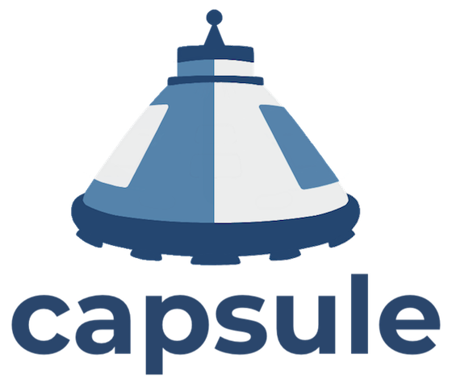

<p align="left">
  
  
  <a href="https://github.com/projectcapsule/capsule/releases">
    
  </a>
  <a href="https://charmhub.io/capsule-k8s">
    
  </a>
  <a href="https://www.bestpractices.dev/projects/5601">
    
  </a>
  <a href="https://api.securityscorecards.dev/projects/github.com/projectcapsule/capsule/badge">
    
  </a>
  <a href="https://artifacthub.io/packages/search?repo=projectcapsule">
    
  </a>
  <a href="https://app.fossa.com/projects/git%2Bgithub.com%2Fprojectcapsule%2Fcapsule?ref=badge_shield&issueType=license" alt="FOSSA Status">
    
  </a>
</p>

<p align="center">
  
</p>

---

**Join the community** on the [#capsule](https://kubernetes.slack.com/archives/C03GETTJQRL) channel in the [Kubernetes Slack](https://slack.k8s.io/).

# Kubernetes multi-tenancy made easy

**Capsule** implements a multi-tenant and policy-based environment in your Kubernetes cluster. It is designed as a micro-services-based ecosystem with the minimalist approach, leveraging only on upstream Kubernetes.

# What's the problem with the current status?

Kubernetes introduces the _Namespace_ object type to create logical partitions of the cluster as isolated *slices*. However, implementing advanced multi-tenancy scenarios, it soon becomes complicated because of the flat structure of Kubernetes namespaces and the impossibility to share resources among namespaces belonging to the same tenant. To overcome this, cluster admins tend to provision a dedicated cluster for each groups of users, teams, or departments. As an organization grows, the number of clusters to manage and keep aligned becomes an operational nightmare, described as the well known phenomena of the _clusters sprawl_.

# Entering Capsule

Capsule takes a different approach. In a single cluster, the Capsule Controller aggregates multiple namespaces in a lightweight abstraction called _Tenant_, basically a grouping of Kubernetes Namespaces. Within each tenant, users are free to create their namespaces and share all the assigned resources. 

On the other side, the Capsule Policy Engine keeps the different tenants isolated from each other. _Network and Security Policies_, _Resource Quota_, _Limit Ranges_, _RBAC_, and other policies defined at the tenant level are automatically inherited by all the namespaces in the tenant. Then users are free to operate their tenants in autonomy, without the intervention of the cluster administrator. 

# Features

## Self-Service

Leave developers the freedom to self-provision their cluster resources according to the assigned boundaries.

## Preventing Clusters Sprawl

Share a single cluster with multiple teams, groups of users, or departments by saving operational and management efforts.

## Governance

Leverage Kubernetes Admission Controllers to enforce the industry security best practices and meet policy requirements.

## Resources Control

Take control of the resources consumed by users while preventing them to overtake.

## Native Experience

Provide multi-tenancy with a native Kubernetes experience without introducing additional management layers, plugins, or customized binaries.

## GitOps ready

Capsule is completely declarative and GitOps ready.

## Bring your own device (BYOD)

Assign to tenants a dedicated set of compute, storage, and network resources and avoid the noisy neighbors' effect.

# Documentation

Please, check the project [documentation](https://capsule.clastix.io) for the cool things you can do with Capsule.

# Contributions

Capsule is Open Source with Apache 2 license and any contribution is welcome.

## Chart Development

### Chart Linting

The chart is linted with [ct](https://github.com/helm/chart-testing). You can run the linter locally with this command:

```
make helm-lint
```

### Chart Documentation

The documentation for each chart is done with [helm-docs](https://github.com/norwoodj/helm-docs). This way we can ensure that values are consistent with the chart documentation. Run this anytime you make changes to a `values.yaml` file:

```
make helm-docs
```

## Community meeting

Join the community, share and learn from it. You can find all the resources to how to contribute code and docs, connect with people in the [community repository](https://github.com/projectcapsule/capsule-community).

Please read the [code of conduct](CODE_OF_CONDUCT.md).

## Adopters

See the [ADOPTERS.md](ADOPTERS.md) file for a list of companies that are using Capsule.

# Governance

You can find how the Capsule project is governed [here](https://capsule.clastix.io/docs/contributing/governance).

## Maintainers

Please, refer to the maintainers file available [here](.github/maintainers.yaml).

## Release process

Please, refer to the [documentation page](https://capsule.clastix.io/docs/contributing/release).

### Changelog

Read how we log changes [here](CHANGELOG.md)

### Software Bill of Materials

All OCI release artifacts include a Software Bill of Materials (SBOM) in CycloneDX JSON format. More information on this is available [here](SECURITY.md#software-bill-of-materials-sbom)

# FAQ

- Q. How to pronounce Capsule?

  A. It should be pronounced as `/ˈkæpsjuːl/`.

- Q. Is it production grade?

  A. Although under frequent development and improvements, Capsule is ready to be used in production environments as currently, people are using it in public and private deployments. Check out the [release](https://github.com/projectcapsule/capsule/releases) page for a detailed list of available versions.

- Q. Does it work with my Kubernetes XYZ distribution?

  A. We tested Capsule with vanilla Kubernetes 1.16+ on private environments and public clouds. We expect it to work smoothly on any other Kubernetes distribution. Please, let us know if you find it doesn't.

- Q. Do you provide commercial support?

  A. Yes, we're available to help and provide commercial support. [Clastix](https://clastix.io) is the company behind Capsule. Please, contact us for a quote. 
