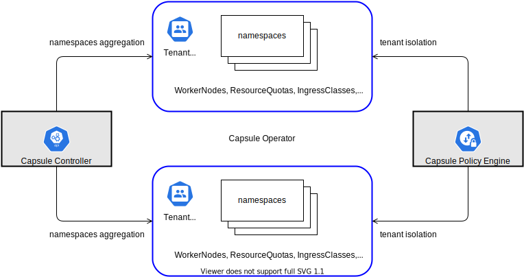

<p align="left">
  
  
  <a href="https://github.com/clastix/capsule/releases">
    
  </a>
</p>

<p align="center">
  
</p>

---

# Kubernetes multi-tenancy made simple
**Capsule** helps to implement a multi-tenancy and policy-based environment in your Kubernetes cluster. It is not intended to be yet another _PaaS_, instead, it has been designed as a micro-services based ecosystem with minimalist approach, leveraging only on upstream Kubernetes. 

# What's the problem with the current status?
Kubernetes introduces the _Namespace_ object type to create logical partitions of the cluster as isolated *slices*. However, implementing advanced multi-tenancy scenarios, it soon becomes complicated because of the flat structure of Kubernetes namespaces and the impossibility to share resources among namespaces belonging to the same tenant. To overcome this, cluster admins tend to provision a dedicated cluster for each groups of users, teams, or departments. As an organization grows, the number of clusters to manage and keep aligned becomes an operational nightmare, described as the well know phenomena of the _clusters sprawl_.

# Entering Capsule
Capsule takes a different approach. In a single cluster, the Capsule Controller aggregates multiple namespaces in a lightweight abstraction called _Tenant_. Within each tenant, users are free to create their namespaces and share all the assigned resources while the Capsule Policy Engine keeps the different tenants isolated from each other.

The _Network and Security Policies_, _Resource Quota_, _Limit Ranges_, _RBAC_, and other policies defined at the tenant level are automatically inherited by all the namespaces in the tenant. And users are free to operate their tenants in authonomy, without the intervention of the cluster administrator. Take a look at following diagram:

<p align="center" style="padding: 60px 20px">
  
</p>

# Features
## Self-Service
Leave to developers the freedom to self-provision their cluster resources according to the assigned boundaries.

## Preventing Clusters Sprawl
Share a single cluster with multiple teams, groups of users, or departments by saving operational and management efforts.

## Governance
Leverage Kubernetes Admission Controllers to enforce the industry security best practices and meet legal requirements.

## Resources Control
Take control of the resources consumed by users while preventing them to overtake.

## Native Experience
Provide multi-tenancy with a native Kubernetes experience without introducing additional management layers, plugins, or customised binaries.

## GitOps ready
Capsule is completely declarative and GitOps ready.

## Bring your own device (BYOD)
Assign to tenants a dedicated set of compute, storage, and network resources and avoid the noisy neighbors' effect.

# Common use cases for Capsule
Please, refer to the corresponding [section](./docs/operator/use-cases/overview.md) in the project documentation for a detailed list of common use cases that Capsule can address.

# Installation
Make sure you have access to a Kubernetes cluster as administrator.

There are two ways to install Capsule:

* Use the Helm Chart available [here](./charts/capsule/README.md)
* Use [`kustomize`](https://github.com/kubernetes-sigs/kustomize)

## Install with kustomize
Ensure you have `kubectl` and `kustomize` installed in your `PATH`. 

Clone this repository and move to the repo folder:

```
$ git clone https://github.com/clastix/capsule
$ cd capsule
$ make deploy
```

It will install the Capsule controller in a dedicated namespace `capsule-system`.

## How to create Tenants
Use the scaffold [Tenant](config/samples/capsule_v1alpha1_tenant.yaml) and simply apply as cluster admin.

```
$ kubectl apply -f config/samples/capsule_v1alpha1_tenant.yaml
tenant.capsule.clastix.io/oil created
```

You can check the tenant just created as

```
$ kubectl get tenants
NAME      NAMESPACE QUOTA   NAMESPACE COUNT   OWNER NAME   OWNER KIND   NODE SELECTOR    AGE
oil       3                 0                 alice        User                          1m
```

## Tenant owners
Each tenant comes with a delegated user or group of users acting as the tenant admin. In the Capsule jargon, this is called the _Tenant Owner_. Other users can operate inside a tenant with different levels of permissions and authorizations assigned directly by the Tenant Owner.

Capsule does not care about the authentication strategy used in the cluster and all the Kubernetes methods of [authentication](https://kubernetes.io/docs/reference/access-authn-authz/authentication/) are supported. The only requirement to use Capsule is to assign tenant users to the the group defined by `--capsule-user-group` option, which defaults to `capsule.clastix.io`.

Assignment to a group depends on the authentication strategy in your cluster.

For example, if you are using `capsule.clastix.io`, users authenticated through a _X.509_ certificate must have `capsule.clastix.io` as _Organization_: `-subj "/CN=${USER}/O=capsule.clastix.io"`

Users authenticated through an _OIDC token_ must have

```json
...
"users_groups": [
    "capsule.clastix.io",
    "other_group"
]
```

in their token.

The [hack/create-user.sh](hack/create-user.sh) can help you set up a dummy `kubeconfig` for the `alice` user acting as owner of a tenant called `oil`

```bash
./hack/create-user.sh alice oil
creating certs in TMPDIR /tmp/tmp.4CLgpuime3 
Generating RSA private key, 2048 bit long modulus (2 primes)
............+++++
........................+++++
e is 65537 (0x010001)
certificatesigningrequest.certificates.k8s.io/alice-oil created
certificatesigningrequest.certificates.k8s.io/alice-oil approved
kubeconfig file is: alice-oil.kubeconfig
to use it as alice export KUBECONFIG=alice-oil.kubeconfig
```

## Working with Tenants
Log in to the Kubernetes cluster as `alice` tenant owner

```
$ export KUBECONFIG=alice-oil.kubeconfig
```

and create a couple of new namespaces

```
$ kubectl create namespace oil-production
$ kubectl create namespace oil-development
```

As user `alice` you can operate with fully admin permissions:

```
$ kubectl -n oil-development run nginx --image=docker.io/nginx 
$ kubectl -n oil-development get pods
```

but limited to only your own namespaces:

```
$ kubectl -n kube-system get pods
Error from server (Forbidden): pods is forbidden:
User "alice" cannot list resource "pods" in API group "" in the namespace "kube-system"
```

# Documentation
Please, check the project [documentation](./docs/index.md) for more cool things you can do with Capsule.

# Removal
Similar to `deploy`, you can get rid of Capsule using the `remove` target.

```
$ make remove
```

# FAQ
- Q. How to pronunce Capsule?

  A. It should be pronounced as `/ˈkæpsjuːl/`.

- Q. Can I contribute?

  A. Absolutely! Capsule is Open Source with Apache 2 license and any contribution is welcome. Please refer to the corresponding [section](./docs/operator/contributing.md) in the documentation.

- Q. Is it production grade?

  A. Although under frequent development and improvements, Capsule is ready to be used in production environments as currently, people are using it in public and private deployments. Check out the [release](https://github.com/clastix/capsule/releases) page for a detailed list of available versions.

- Q. Does it work with my Kuberentes XYZ distribution?

  A. We tested Capsule with vanilla Kubernetes 1.16+ on private envirnments and public clouds. We expect it works smootly on any other distribution. Please, let us know if you find it doesn't.

- Q. Do you provide commercial support?

  A. Yes, we're available to help and provide commercial support. [Clastix](https://clastix.io) is the company behind Capsule. Please, contact us for a quote. 
