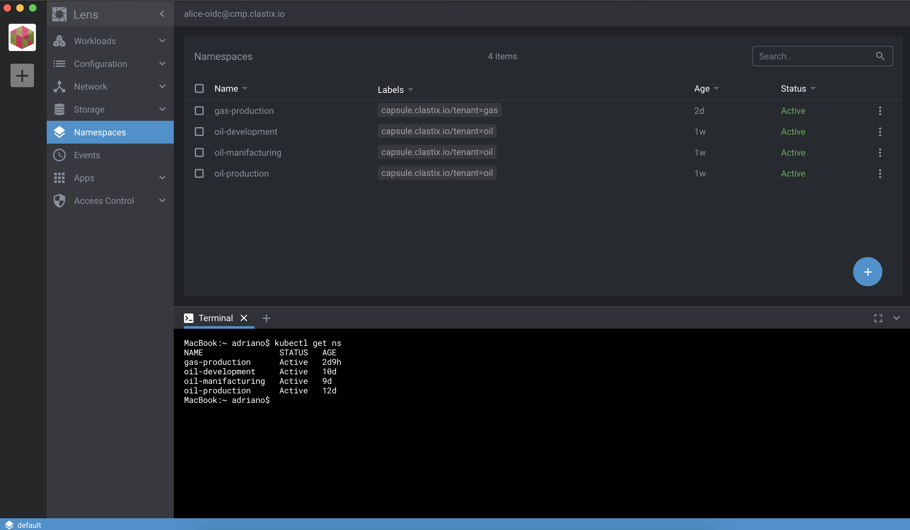
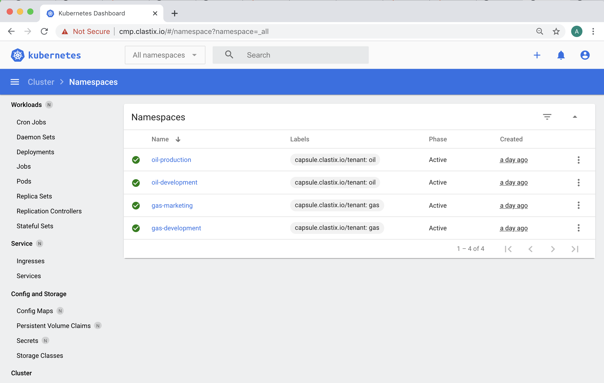

# Capsule Proxy

Capsule Proxy is an add-on for Capsule Operator addressing some RBAC issues when enabling multi-tenacy in Kubernetes since users cannot list the owned cluster-scoped resources.

Kubernetes RBAC cannot list only the owned cluster-scoped resources since there are no ACL-filtered APIs. For example:

```
$ kubectl get namespaces
Error from server (Forbidden): namespaces is forbidden:
User "alice" cannot list resource "namespaces" in API group "" at the cluster scope
```

However, the user can have permissions on some namespaces

```
$ kubectl auth can-i [get|list|watch|delete] ns oil-production
yes
```

The reason, as the error message reported, is that the RBAC _list_ action is available only at Cluster-Scope and it is not granted to users without appropriate permissions.

To overcome this problem, many Kubernetes distributions introduced mirrored custom resources supported by a custom set of ACL-filtered APIs. However, this leads to radically change the user's experience of Kubernetes by introducing hard customizations that make it painful to move from one distribution to another.

With **Capsule**, we took a different approach. As one of the key goals, we want to keep the same user's experience on all the distributions of Kubernetes. We want people to use the standard tools they already know and love and it should just work.

## How it works

The `capsule-proxy` implements a simple reverse proxy that intercepts only specific requests to the APIs server and Capsule does all the magic behind the scenes.

Current implementation filters the following requests:

* `/api/scheduling.k8s.io/{v1}/priorityclasses{/name}`
* `/api/v1/namespaces{/name}`
* `/api/v1/nodes{/name}`
* `/api/v1/pods?fieldSelector=spec.nodeName%3D{name}`
* `/apis/coordination.k8s.io/v1/namespaces/kube-node-lease/leases/{name}`
* `/apis/metrics.k8s.io/{v1beta1}/nodes{/name}`
* `/apis/networking.k8s.io/{v1,v1beta1}/ingressclasses{/name}`
* `/apis/storage.k8s.io/v1/storageclasses{/name}`

All other requests are proxied transparently to the APIs server, so no side effects are expected. We're planning to add new APIs in the future, so [PRs are welcome](https://github.com/clastix/capsule-proxy)!

## Installation

Capsule Proxy is an optional add-on of the main Capsule Operator, so make sure you have a working instance of Capsule before attempting to install it.
Use the `capsule-proxy` only if you want Tenant Owners to list their own Cluster-Scope resources.

The `capsule-proxy` can be deployed in standalone mode, e.g. running as a pod bridging any Kubernetes client to the APIs server.
Optionally, it can be deployed as a sidecar container in the backend of a dashboard.

Running outside a Kubernetes cluster is also viable, although a valid `KUBECONFIG` file must be provided, using the environment variable `KUBECONFIG` or the default file in `$HOME/.kube/config`.

A Helm Chart is available [here](https://github.com/clastix/capsule-proxy/blob/master/charts/capsule-proxy/README.md).

Depending on your environment, you can expose the `capsule-proxy` by:

- Ingress
- NodePort Service
- LoadBalance Service
- HostPort
- HostNetwork

Here how it looks like when exposed through an Ingress Controller:

```
                +-----------+          +-----------+         +-----------+
 kubectl ------>|:443       |--------->|:9001      |-------->|:6443      |
                +-----------+          +-----------+         +-----------+
                ingress-controller     capsule-proxy         kube-apiserver
``` 

## CLI flags

- `capsule-configuration-name`: name of the `CapsuleConfiguration` resource which is containing the [Capsule configurations](/docs/general/references/#capsule-configuration) (default: `default`)
- `capsule-user-group` (deprecated): old way to specify the user groups which request must be intercepted by the proxy
- `ignored-user-group`: names of the groups which requests must be ignored and proxy-passed to the upstream server
- `listening-port`: HTTP port the proxy listens to (default: `9001`)
- `oidc-username-claim`: the OIDC field name used to identify the user (default: `preferred_username`), the proper value can be extracted from the Kubernetes API Server flags
- `enable-ssl`: enable the bind on HTTPS for secure communication, allowing client-based certificate, also knows as mutual TLS (default: `true`)
- `ssl-cert-path`: path to the TLS certificate, then TLS mode is enabled (default: `/opt/capsule-proxy/tls.crt`)
- `ssl-key-path`: path to the TLS certificate key, when TLS mode is enabled (default: `/opt/capsule-proxy/tls.key`)
- `rolebindings-resync-period`: resync period for RoleBinding resources reflector, lower values can help if you're facing [flaky etcd connection](https://github.com/clastix/capsule-proxy/issues/174) (default: `10h`)

## User Authentication

The `capsule-proxy` intercepts all the requests from the `kubectl` client directed to the APIs Server. Users using a TLS client based authentication with certificate and key are able to talks with APIs Server since it is able to forward client certificates to the Kubernetes APIs server.

It is possible to protect the `capsule-proxy` using a certificate provided by Let's Encrypt. Keep in mind that, in this way, the TLS termination will be executed by the Ingress Controller, meaning that the authentication based on client certificate will be withdrawn and not reversed to the upstream.

If your prerequisite is exposing `capsule-proxy` using an Ingress, you must rely on the token-based authentication, for example OIDC or Bearer tokens. Users providing tokens are always able to reach the APIs Server.

## Kubernetes dashboards integration

If you're using a client-only dashboard, for example [Lens](https://k8slens.dev/), the `capsule-proxy` can be used as with `kubectl` since this dashboard usually talks to the APIs server using just a `kubeconfig` file.



For a web-based dashboard, like the [Kubernetes Dashboard](https://github.com/kubernetes/dashboard), the `capsule-proxy` can be deployed as a sidecar container in the backend, following the well-known cloud-native _Ambassador Pattern_.



## Tenant Owner Authorization

Each Tenant owner can have their capabilities managed pretty similar to a standard Kubernetes RBAC.

```yaml
apiVersion: capsule.clastix.io/v1beta1
kind: Tenant
metadata:
  name: my-tenant
spec:
  owners:
  - kind: User
    name: alice
    proxySettings:
    - kind: IngressClasses
      operations:
      - List
```

The proxy setting `kind` is an __enum__ accepting the supported resources:

- `Nodes`
- `StorageClasses`
- `IngressClasses`
- `PriorityClasses`

Each Resource kind can be granted with several verbs, such as:

- `List`
- `Update`
- `Delete`

### Namespaces

As tenant owner `alice`, you can use `kubectl` to create some namespaces:

```
$ kubectl --context alice-oidc@mycluster create namespace oil-production
$ kubectl --context alice-oidc@mycluster create namespace oil-development
$ kubectl --context alice-oidc@mycluster create namespace gas-marketing
```

and list only those namespaces:

```
$ kubectl --context alice-oidc@mycluster get namespaces
NAME                STATUS   AGE
gas-marketing       Active   2m
oil-development     Active   2m
oil-production      Active   2m
```

Capsule Proxy supports applying a Namespace configuration using the `apply` command, as follows.

```
$: cat <<EOF | kubectl apply -f -
apiVersion: v1
kind: Namespace
metadata:
  name: solar-development
EOF

namespace/solar-development unchanged
# or, in case of non existing Namespace:
namespace/solar-development created
```

### Nodes

The Capsule Proxy gives the owners the ability to access the nodes matching the `.spec.nodeSelector` in the Tenant manifest:

```yaml
apiVersion: capsule.clastix.io/v1beta1
kind: Tenant
metadata:
  name: oil
spec:
  owners:
    - kind: User
      name: alice
      proxySettings:
        - kind: Nodes
          operations:
            - List
  nodeSelector:
    kubernetes.io/hostname: capsule-gold-qwerty
```

```bash
$ kubectl --context alice-oidc@mycluster get nodes
NAME                    STATUS   ROLES    AGE   VERSION
capsule-gold-qwerty     Ready    <none>   43h   v1.19.1
```

> Warning: when no `nodeSelector` is specified, the tenant owners has access to all the nodes, according to the permissions listed in the `proxySettings` specs.

### Special routes for kubectl describe

When issuing a `kubectl describe node`, some other endpoints are put in place:

* `api/v1/pods?fieldSelector=spec.nodeName%3D{name}`
* `/apis/coordination.k8s.io/v1/namespaces/kube-node-lease/leases/{name}`

These are mandatory in order to retrieve the list of the running Pods on the required node, and providing info about the lease status of it.

### Storage Classes

A Tenant may be limited to use a set of allowed Storage Class resources, as follows.

```yaml
apiVersion: capsule.clastix.io/v1beta1
kind: Tenant
metadata:
  name: oil
spec:
  owners:
  - kind: User
    name: alice
    proxySettings:
    - kind: StorageClasses
      operations:
      - List
  storageClasses:
    allowed:
      - custom
    allowedRegex: "\\w+fs"
```

In the Kubernetes cluster we could have more Storage Class resources, some of them forbidden and non-usable by the Tenant owner.

```bash
$ kubectl --context admin@mycluster get storageclasses
NAME                 PROVISIONER              RECLAIMPOLICY   VOLUMEBINDINGMODE      ALLOWVOLUMEEXPANSION   AGE
cephfs               rook.io/cephfs           Delete          WaitForFirstConsumer   false                  21h
custom               custom.tls/provisioner   Delete          WaitForFirstConsumer   false                  43h
default(standard)    rancher.io/local-path    Delete          WaitForFirstConsumer   false                  43h
glusterfs            rook.io/glusterfs        Delete          WaitForFirstConsumer   false                  54m
zol                  zfs-on-linux/zfs         Delete          WaitForFirstConsumer   false                  54m
```

The expected output using `capsule-proxy` is the retrieval of the `custom` Storage Class as well the other ones matching the regex `\w+fs`.

```bash
$ kubectl --context alice-oidc@mycluster get storageclasses
NAME                 PROVISIONER              RECLAIMPOLICY   VOLUMEBINDINGMODE      ALLOWVOLUMEEXPANSION   AGE
cephfs               rook.io/cephfs           Delete          WaitForFirstConsumer   false                  21h
custom               custom.tls/provisioner   Delete          WaitForFirstConsumer   false                  43h
glusterfs            rook.io/glusterfs        Delete          WaitForFirstConsumer   false                  54m
```

> The `name` label reflecting the resource name is mandatory, otherwise filtering of resources cannot be put in place

```yaml
apiVersion: storage.k8s.io/v1
kind: StorageClass
metadata:
  labels:
    name: cephfs
  name: cephfs
provisioner: cephfs

```

### Ingress Classes

As for Storage Class, also Ingress Class can be enforced.

```yaml
apiVersion: capsule.clastix.io/v1beta1
kind: Tenant
metadata:
  name: oil
spec:
  owners:
  - kind: User
    name: alice
    proxySettings:
    - kind: IngressClasses
      operations:
      - List
  ingressOptions:
    allowedClasses:
        allowed:
          - custom
        allowedRegex: "\\w+-lb"
```

In the Kubernetes cluster we could have more Ingress Class resources, some of them forbidden and non-usable by the Tenant owner.

```bash
$ kubectl --context admin@mycluster get ingressclasses
NAME              CONTROLLER                 PARAMETERS                                      AGE
custom            example.com/custom         IngressParameters.k8s.example.com/custom        24h
external-lb       example.com/external       IngressParameters.k8s.example.com/external-lb   2s
haproxy-ingress   haproxy.tech/ingress                                                       4d
internal-lb       example.com/internal       IngressParameters.k8s.example.com/external-lb   15m
nginx             nginx.plus/ingress                                                         5d
```

The expected output using `capsule-proxy` is the retrieval of the `custom` Ingress Class as well the other ones matching the regex `\w+-lb`.

```bash
$ kubectl --context alice-oidc@mycluster get ingressclasses
NAME              CONTROLLER                 PARAMETERS                                      AGE
custom            example.com/custom         IngressParameters.k8s.example.com/custom        24h
external-lb       example.com/external       IngressParameters.k8s.example.com/external-lb   2s
internal-lb       example.com/internal       IngressParameters.k8s.example.com/internal-lb   15m
```

> The `name` label reflecting the resource name is mandatory, otherwise filtering of resources cannot be put in place

```yaml
apiVersion: networking.k8s.io/v1
kind: IngressClass
metadata:
  labels:
    name: external-lb
  name: external-lb
spec:
  controller: example.com/ingress-controller
  parameters:
    apiGroup: k8s.example.com
    kind: IngressParameters
    name: external-lb
```

### Priority Classes

Allowed PriorityClasses assigned to a Tenant Owner can be enforced as follows:

```yaml
apiVersion: capsule.clastix.io/v1beta1
kind: Tenant
metadata:
  name: oil
spec:
  owners:
  - kind: User
    name: alice
    proxySettings:
    - kind: PriorityClasses
      operations:
      - List
  priorityClasses:
    allowed:
      - custom
    allowedRegex: "\\w+priority"
```

In the Kubernetes cluster we could have more PriorityClasses resources, some of them forbidden and non-usable by the Tenant owner.

```bash
$ kubectl --context admin@mycluster get priorityclasses.scheduling.k8s.io
NAME                      VALUE        GLOBAL-DEFAULT   AGE
custom                    1000         false            18s
maxpriority               1000         false            18s
minpriority               1000         false            18s
nonallowed                1000         false            8m54s
system-cluster-critical   2000000000   false            3h40m
system-node-critical      2000001000   false            3h40m
```

The expected output using `capsule-proxy` is the retrieval of the `custom` PriorityClass as well the other ones matching the regex `\w+priority`.

```bash
$ kubectl --context alice-oidc@mycluster get ingressclasses
NAME                      VALUE        GLOBAL-DEFAULT   AGE
custom                    1000         false            18s
maxpriority               1000         false            18s
minpriority               1000         false            18s
```

> The `name` label reflecting the resource name is mandatory, otherwise filtering of resources cannot be put in place

```yaml
apiVersion: scheduling.k8s.io/v1
kind: PriorityClass
metadata:
  labels:
    name: custom
  name: custom
value: 1000
globalDefault: false
description: "Priority class for Tenants"
```

### ProxySetting Use Case
Consider a scenario, where a cluster admin creates a tenant and assign ownership of the tenant to a user, so called tenant owner. Afterwards, tenant owner would in turn like to provide access to their cluster-scoped resources to a set of users (e.g. non-owners or tenant users), groups and service accounts, who doesn't require tenant owner level permissions.

Tenant Owner can provide access to following cluster-scoped resources to their tenant users, groups and service account by creating `ProxySetting` resource
- `Nodes`
- `StorageClasses`
- `IngressClasses`
- `PriorityClasses`

Each Resource kind can be granted with following verbs, such as:
- `List`
- `Update`
- `Delete`

These tenant users, groups and services accounts have less privileged access than tenant owners.

As a Tenant Owner `alice`, you can create a `ProxySetting` resources to allow `bob` to list nodes, storage classes, ingress classes and priority classes
```yaml
apiVersion: capsule.clastix.io/v1beta1
kind: ProxySetting
metadata:
  name: sre-readers
  namespace: solar-production
spec:
  subjects:
  - name: bob
    kind: User
    proxySettings:
    - kind: Nodes
      operations:
      - List
    - kind: StorageClasses
      operations:
      - List
    - kind: IngressClasses
      operations:
      - List
    - kind: PriorityClasses
      operations:
      - List
```
As a Tenant User `bob`, you can list nodes, storage classes, ingress classes and priority classes

```bash
$ kubectl auth can-i --context bob-oidc@mycluster get nodes
yes
$ kubectl auth can-i --context bob-oidc@mycluster get storageclasses
yes
$ kubectl auth can-i --context bob-oidc@mycluster get ingressclasses
yes
$ kubectl auth can-i --context bob-oidc@mycluster get priorityclasses
yes
```
## HTTP support
Capsule proxy supports `https` and `http`, although the latter is not recommended, we understand that it can be useful for some use cases (i.e. development, working behind a TLS-terminated reverse proxy and so on). As the default behaviour is to work with `https`, we need to use the flag `--enable-ssl=false` if we really want to work under `http`.

After having the `capsule-proxy` working under `http`, requests must provide authentication using an allowed Bearer Token.

For example:

```bash
$ TOKEN=<type your TOKEN>
$ curl -H "Authorization: Bearer $TOKEN" http://localhost:9001/api/v1/namespaces
```

> NOTE: `kubectl` will not work against a `http` server.

## Contributing

`capsule-proxy` is an open-source software released with Apache2 [license](https://github.com/clastix/capsule-proxy/blob/master/LICENSE).

Contributing guidelines are available [here](https://github.com/clastix/capsule-proxy/blob/master/CONTRIBUTING.md).
