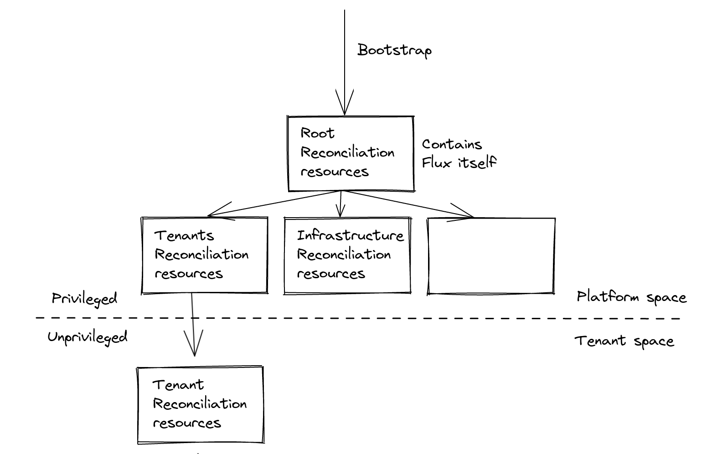
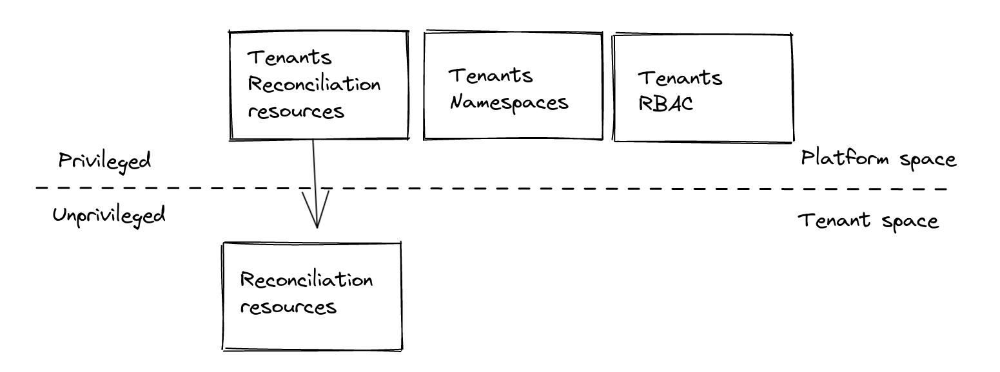
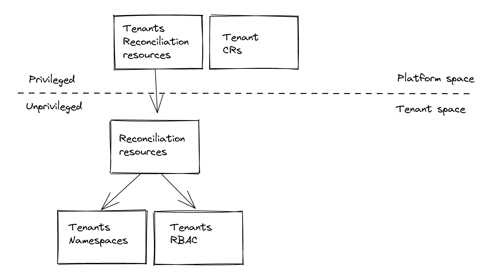

# Multi-tenancy the GitOps way

This guide is intended to cover how to use Flux v2 with [multi-tenancy lockdown features](https://fluxcd.io/docs/installation/#multi-tenancy-lockdown) with Capsule and Capsule Proxy together, to enable a Namespace-as-a-Service the GitOps-way.

### Flux and multi-tenancy

Flux v2 released a [set of features](https://fluxcd.io/blog/2022/05/may-2022-security-announcement/#whats-next-for-flux) that further increased security for multi-tenancy scenarios.

These features enable you to:
- disable cross-Namespace reference of Source CRs from Reconciliation CRs and Notification CRs. This way, especially for tenants, they can't access resources outside their space. This can be achieved with `--no-cross-namespace-refs=true` option of kustomize, helm, notification, image-reflector, image-automation controllers.
- set a default `ServiceAccount` impersonation for Reconciliation CRs. This is supposed to be an unprivileged SA that reconciles just the tenant's desired state. This will be enforced when is not otherwise specified explicitly in Reconciliation CR spec. This can be enforced with the `--default-service-account=<name>` option of helm and kustomize controllers.

  > For this responsibility we identify a Tenant GitOps Reconciler identity, which is a ServiceAccount and it's also the tenant owner (more on tenants and owners later on, with Capsule).

- disallow remote bases for Kustomizations. Actually, this is not strictly required, but it decreases the risk of referencing Kustomizations which aren't part of the controlled GitOps pipelines. In a multi-tenant scenario this is important too. They can be disabled with `--no-remote-bases=true` option of the kustomize controller.

Where required, to ensure privileged Reconciliation resources have the needed privileges to be reconciled, we can explicitly set a privileged `ServiceAccount`s.

In any case, is required that the `ServiceAccount` is in the same `Namespace` of the `Kustomization`, so unprivileged spaces should not have privileged `ServiceAccount`s available.

For example, for the root `Kustomization`:

```yaml
apiVersion: kustomize.toolkit.fluxcd.io/v1beta2
kind: Kustomization
metadata:
  name: flux-system
  namespace: flux-system
spec:
  serviceAccountName: kustomize-controller # It has cluster-admin permissions
  path: ./clusters/staging
  sourceRef:
    kind: GitRepository
    name: flux-system
```

In example, the cluster admin is supposed to apply this Kustomization, during the cluster bootstrap that i.e. will reconcile also Flux itself.
All the remaining Reconciliation resources can be children of this Kustomization.



### Namespace-as-a-Service

Tenants could have his own set of Namespaces to operate on but it should be prepared by higher-level roles, like platform admins: the declarations would be part of the platform space.
They would be responsible of tenants administration, and each change (e.g. new tenant Namespace) should be a request that would pass through approval.



What if we would like to provide tenants the ability to manage also their own space the GitOps-way? Enter Capsule.



## The ingredients of the recipe

> Legenda:
> - Privileged space: group of Namespaces which are not part of any Tenant.
> - Privileged identity: identity that won't pass through Capsule tenant access control.
> - Unprivileged space: group of Namespaces which are part of a Tenant.
> - Unprivileged identity: identity that would pass through Capsule tenant access control.
> - Tenant GitOps Reconciler: a machine Tenant Owner expected to reconcile Tenant desired state.

### Capsule

Capsule provides a Custom Resource `Tenant` and ability to set its owners through `spec.owners` as references to:
- `User`
- `Group`
- `ServiceAccount`

#### Tenant and Tenant Owner

We would like to let a machine reconcile Tenant's states, we'll need a `ServiceAccount` as a Tenant Owner:

```yaml
apiVersion: v1
kind: ServiceAccount
metadata:
  name: gitops-reconciler
  namespace: my-tenant
---
apiVersion: capsule.clastix.io/v1beta2
kind: Tenant
metadata:
  name: my-tenant
spec:
  owners:
  - name: system:serviceaccount:my-tenant:gitops-reconciler # the Tenant GitOps Reconciler
```

From now on, we'll refer to it as the **Tenant GitOps Reconciler**.

#### Tenant Groups

We also need to state that Capsule should enforce tenant access control for requests coming from tenants, and we can do that by specifying one of the `Group`s bound by default by Kubernetes to the Tenant GitOps Reconciler `ServiceAccount` in the `CapsuleConfiguration`:

```yaml
apiVersion: capsule.clastix.io/v1beta2
kind: CapsuleConfiguration
metadata:
  name: default
spec:
  userGroups:
  - system:serviceaccounts:my-tenant
```

Other privileged requests, e.g. for reconciliation coming from the Flux privileged `ServiceAccount`s like `flux-system/kustomize-controller` will bypass Capsule.

### Flux

Flux enables to specify with which identity Reconciliation resources are reconciled, through:
- `ServiceAccount` impersonation
- `kubeconfig`

#### ServiceAccount

As by default Flux reconciles those resources with Flux `cluster-admin` Service Accounts, we set at controller-level the **default `ServiceAccount` impersonation** to the unprivileged **Tenant GitOps Reconciler**:

```yaml
apiVersion: kustomize.config.k8s.io/v1beta1
kind: Kustomization
resources:
- flux-controllers.yaml
patches:
  - patch: |
      - op: add
        path: /spec/template/spec/containers/0/args/0
        value: --default-service-account=gitops-reconciler # the Tenant GitOps Reconciler
    target:
      kind: Deployment
      name: "(kustomize-controller|helm-controller)"
```

This way tenants can't make Flux apply their Reconciliation resources with Flux's privileged Service Accounts, by not specifying a `spec.ServiceAccountName` on them. 

At the same time at resource-level in privileged space we still can specify a privileged ServiceAccount, and its reconciliation requests won't pass through Capsule validation:

```yaml
apiVersion: kustomize.toolkit.fluxcd.io/v1beta2
kind: Kustomization
metadata:
  name: flux-system
  namespace: flux-system
spec:
  serviceAccountName: kustomize-controller
  path: ./clusters/staging
  sourceRef:
    kind: GitRepository
    name: flux-system
```

#### Kubeconfig

We also need to specify on Tenant's Reconciliation resources, the `Secret` with **`kubeconfig`** configured to use the **Capsule Proxy** as the API server in order to provide the Tenant GitOps Reconciler the ability to list cluster-level resources.
The `kubeconfig` would specify also as the token the Tenant GitOps Reconciler SA token, 

For example:

```yaml
apiVersion: kustomize.toolkit.fluxcd.io/v1beta2
kind: Kustomization
metadata:
  name: my-app
  namespace: my-tenant
spec:
  kubeConfig:
    secretRef:
      name: gitops-reconciler-kubeconfig
      key: kubeconfig 
  sourceRef:
    kind: GitRepository
    name: my-tenant
  path: ./staging
```

> We'll see how to prepare the related `Secret` (i.e. *gitops-reconciler-kubeconfig*) later on.

Each request made with this kubeconfig will be done impersonating the user of the default impersonation SA, that is the same of the token specified in the kubeconfig.
To deepen on this please go to [#Insights](#insights).

## The recipe

### How to setup Tenants GitOps-ready

Given that [Capsule](github.com/clastix/capsule) and [Capsule Proxy](github.com/clastix/capsule-proxy) are installed, and [Flux v2](https://github.com/fluxcd/flux2) configured with [multi-tenancy lockdown](https://fluxcd.io/docs/installation/#multi-tenancy-lockdown) features, of which the patch below:

```yaml
apiVersion: kustomize.config.k8s.io/v1beta1
kind: Kustomization
resources:
- flux-components.yaml
patches:
  - patch: |
      - op: add
        path: /spec/template/spec/containers/0/args/0
        value: --no-cross-namespace-refs=true      
    target:
      kind: Deployment
      name: "(kustomize-controller|helm-controller|notification-controller|image-reflector-controller|image-automation-controller)"
  - patch: |
      - op: add
        path: /spec/template/spec/containers/0/args/-
        value: --no-remote-bases=true      
    target:
      kind: Deployment
      name: "kustomize-controller"
  - patch: |
      - op: add
        path: /spec/template/spec/containers/0/args/0
        value: --default-service-account=gitops-reconciler # The Tenant GitOps Reconciler
    target:
      kind: Deployment
      name: "(kustomize-controller|helm-controller)"
  - patch: |
      - op: add
        path: /spec/serviceAccountName
        value: kustomize-controller      
    target:
      kind: Kustomization
      name: "flux-system"
```

this is the required set of resources to setup a Tenant:
- `Namespace`: the Tenant GitOps Reconciler "home". This is not part of the Tenant to avoid a chicken & egg problem:
  ```yaml
  apiVersion: v1
  kind: Namespace
  metadata:
    name: my-tenant
  ```
- `ServiceAccount` of the Tenant GitOps Reconciler, in the above `Namespace`:
  ```yaml
  apiVersion: v1
  kind: ServiceAccount
  metadata:
    name: gitops-reconciler
    namespace: my-tenant
  ```
- `Tenant` resource with the above Tenant GitOps Reconciler's SA as Tenant Owner, with:
- Additional binding to *cluster-admin* `ClusterRole` for the Tenant's `Namespace`s and `Namespace` of the Tenant GitOps Reconciler' `ServiceAccount`.
  By default Capsule binds only `admin` ClusterRole, which has no privileges over Custom Resources, but *cluster-admin* has. This is needed to operate on Flux CRs:
  ```yaml
  apiVersion: capsule.clastix.io/v1beta2
  kind: Tenant
  metadata:
    name: my-tenant
  spec:
    additionalRoleBindings:
    - clusterRoleName: cluster-admin
      subjects:
      - name: gitops-reconciler
        kind: ServiceAccount
        namespace: my-tenant
    owners:
    - name: system:serviceaccount:my-tenant:gitops-reconciler
      kind: ServiceAccount
  ```
- Additional binding to *cluster-admin* `ClusterRole` for home `Namespace` of the Tenant GitOps Reconciler' `ServiceAccount`, so that the Tenant GitOps Reconciler can create Flux CRs on the tenant home Namespace and use Reconciliation resource's `spec.targetNamespace` to place resources to `Tenant` `Namespace`s:
  ```yaml
  apiVersion: rbac.authorization.k8s.io/v1
  kind: RoleBinding
  metadata:
    name: gitops-reconciler
    namespace: my-tenant
  roleRef:
    apiGroup: rbac.authorization.k8s.io
    kind: ClusterRole
    name: cluster-admin
  subjects:
  - kind: ServiceAccount
    name: gitops-reconciler
    namespace: my-tenant
  ```
- Additional `Group` in the `CapsuleConfiguration` to make Tenant GitOps Reconciler requests pass through Capsule admission (group `system:serviceaccount:<tenant-gitops-reconciler-home-namespace>`):
  ```yaml
  apiVersion: capsule.clastix.io/v1alpha1
  kind: CapsuleConfiguration
  metadata:
    name: default
  spec:
    userGroups:
    - system:serviceaccounts:my-tenant
  ```
- Additional `ClusterRole` with related `ClusterRoleBinding` that allows the Tenant GitOps Reconciler to impersonate his own `User` (e.g. `system:serviceaccount:my-tenant:gitops-reconciler`):
  ```yaml
  apiVersion: rbac.authorization.k8s.io/v1
  kind: ClusterRole
  metadata:
    name: my-tenant-gitops-reconciler-impersonator
  rules:
  - apiGroups: [""]
    resources: ["users"]
    verbs: ["impersonate"]
    resourceNames: ["system:serviceaccount:my-tenant:gitops-reconciler"]
  ---
  apiVersion: rbac.authorization.k8s.io/v1
  kind: ClusterRoleBinding
  metadata:
    name: my-tenant-gitops-reconciler-impersonate
  roleRef:
    apiGroup: rbac.authorization.k8s.io
    kind: ClusterRole
    name: my-tenant-gitops-reconciler-impersonator
  subjects:
  - name: gitops-reconciler
    kind: ServiceAccount
    namespace: my-tenant
  ```
- `Secret` with `kubeconfig` for the Tenant GitOps Reconciler with Capsule Proxy as `kubeconfig.server` and the SA token as `kubeconfig.token`.
  > This is supported only with Service Account static tokens.
- Flux Source and Reconciliation resources that refer to Tenant desired state. This typically points to a specific path inside a dedicated Git repository, where tenant's root configuration reside: 
  ```yaml
  apiVersion: source.toolkit.fluxcd.io/v1beta2
  kind: GitRepository
  metadata:
    name: my-tenant
    namespace: my-tenant
  spec:
    url: https://github.com/my-tenant/all.git # Git repository URL
    ref:
      branch: main # Git reference
  ---
  apiVersion: kustomize.toolkit.fluxcd.io/v1beta2
  kind: Kustomization
  metadata:
    name: my-tenant
    namespace: my-tenant
  spec:
    kubeConfig:
      secretRef:
        name: gitops-reconciler-kubeconfig
        key: kubeconfig
    sourceRef:
      kind: GitRepository
      name: my-tenant
    path: config # Path to config from GitRepository Source
  ```
  This `Kustomization` can in turn refer to further `Kustomization` resources creating a tenant configuration hierarchy.

#### Generate the Capsule Proxy kubeconfig Secret

You need to create a `Secret` in the Tenant GitOps Reconciler home `Namespace`, containing the `kubeconfig` that specifies:
- `server`: Capsule Proxy `Service` URL with related CA certificate for TLS
- `token`: the token of the `Tenant` GitOps Reconciler

With required privileges over the target `Namespace` to create `Secret`, you can generate it with the `proxy-kubeconfig-generator` utility:

```sh
$ go install github.com/maxgio92/proxy-kubeconfig-generator@latest
$ proxy-kubeconfig-generator \
  --kubeconfig-secret-key kubeconfig \
  --namespace my-tenant \
  --server 'https://capsule-proxy.capsule-system.svc:9001' \
  --server-tls-secret-namespace capsule-system \
  --server-tls-secret-name capsule-proxy \
  --serviceaccount gitops-reconciler
```

### How a Tenant can declare his state

Considering the example above, a Tenant `my-tenant` could place in his own repository (i.e. `https://github.com/my-tenant/all`), on branch `main` at path `/config` further Reconciliation resources, like:

```yaml
apiVersion: kustomize.toolkit.fluxcd.io/v1beta2
kind: Kustomization
metadata:
  name: my-apps
  namespace: my-tenant
spec:
  kubeConfig:
    secretRef:
      name: gitops-reconciler-kubeconfig
      key: kubeconfig 
  sourceRef:
    kind: GitRepository
    name: my-tenant
  path: config/apps
```

that refer to the same Source but different path (i.e. `config/apps`) that could contain his applications' manifests.

The same is valid for a `HelmRelease`s, that instead will refer to an `HelmRepository` Source.

The reconciliation requests will pass through Capsule Proxy as Tenant GitOps Reconciler with impersonation. Then, as the identity group of the requests matches the Capsule groups they will be validated by Capsule, and finally the RBAC will provide boundaries to Tenant GitOps Reconciler privileges.

> If the `spec.kubeConfig` is not specified the Flux privileged `ServiceAccount` will impersonate the default unprivileged Tenant GitOps Reconciler `ServiceAccount` as configured with `--default-service-account` option of kustomize and helm controllers, but it list requests on cluster-level resources like `Namespace`s will fail.

## Full setup

To have a glimpse on a full setup you can follow the [flux2-capsule-multi-tenancy](https://github.com/clastix/flux2-capsule-multi-tenancy.git) repository.
For simplicity, the system and tenants declarations are on the same repository but on dedicated git branches.

It's a fork of [flux2-multi-tenancy](https://github.com/fluxcd/flux2-multi-tenancy.git) but with the integration we saw with Capsule.

## Insights

### Why ServiceAccount that impersonates its own User

As stated just above, you'd be wondering why a user would make a request impersonating himself (i.e. the Tenant GitOps Reconciler ServiceAccount User).

This is because we need to make tenant reconciliation requests through Capsule Proxy and we want to protect from risk of privilege escalation done through bypass of impersonation.

### Threats

##### Bypass unprivileged impersonation

The reason why we can't set impersonation to be optional is because, as each tenant is allowed to not specify neither the kubeconfig nor the impersonation SA for the Reconciliation resource, and because in any case that kubeconfig could contain whatever privileged credentials, Flux would otherwise use the privileged ServiceAccount, to reconcile tenant resources.

That way, a tenant would be capable of managing the GitOps way the cluster as he was a cluster admin.

Furthermore, let's see if there are other vulnerabilities we are able to protect from.

##### Impersonate privileged SA

Then, what if a tenant tries to escalate by using one of the Flux controllers privileged `ServiceAccount`s? 

As `spec.ServiceAccountName` for Reconciliation resource cannot cross-namespace reference Service Accounts, tenants are able to let Flux apply his own resources only with ServiceAccounts that reside in his own Namespaces. Which is, Namespace of the ServiceAccount and Namespace of the Reconciliation resource must match.

He could neither create the Reconciliation resource where a privileged ServiceAccount is present (like flux-system), as the Namespace has to be owned by the Tenant. Capsule would block those Reconciliation resource creation requests.

##### Create and impersonate privileged SA

Then, what if a tenant tries to escalate by creating a privileged `ServiceAccount` inside on of his own `Namespace`s?

A tenant could create a `ServiceAccount` in an owned `Namespace`, but he can't neither bind at cluster-level nor at a non-owned Namespace-level a ClusterRole, as that wouldn't be permitted by Capsule admission controllers.

Now let's go on with the practical part.

##### Change ownership of privileged Namespaces (e.g. flux-system)

He could try to use privileged `ServiceAccount` by changing ownership of a privileged Namespace so that he could create Reconciliation resource there and using the privileged SA.
This is not permitted as he can't patch Namespaces which have not been created by him. Capsule request validation would not pass.

For other protections against threats in this multi-tenancy scenario please see the Capsule [Multi-Tenancy Benchmark](/docs/general/mtb). 

## References
- https://fluxcd.io/docs/installation/#multi-tenancy-lockdown
- https://fluxcd.io/blog/2022/05/may-2022-security-announcement/
- https://github.com/clastix/capsule-proxy/issues/218
- https://github.com/clastix/capsule/issues/528 
- https://github.com/clastix/flux2-capsule-multi-tenancy
- https://github.com/fluxcd/flux2-multi-tenancy
- https://fluxcd.io/docs/guides/repository-structure/
