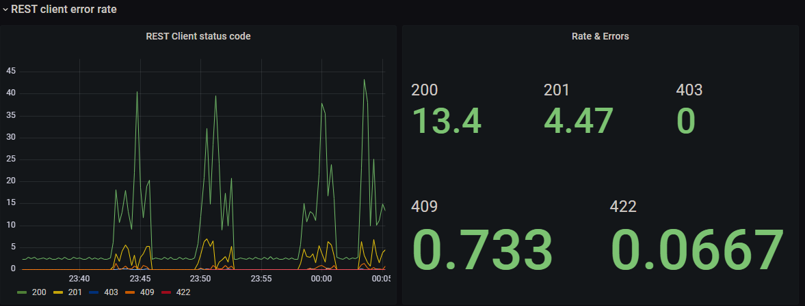

# Monitoring Capsule

The Capsule dashboard allows you to track the health and performance of Capsule manager and tenants, with particular attention to resources saturation, server responses, and latencies. Prometheus and Grafana are requirements for monitoring Capsule.

### Prometheus

Prometheus is an open-source monitoring system and time series database; it is based on a multi-dimensional data model and uses PromQL, a powerful query language, to leverage it.

- Minimum version: 1.0.0

### Grafana

Grafana is an open-source monitoring solution that offers a flexible way to generate visuals and configure dashboards.

- Minimum version: 7.5.5

To fastly deploy this monitoring stack, consider installing the [Prometheus Operator](https://github.com/prometheus-operator/prometheus-operator).

## Quick Start

The Capsule Helm [charts](https://github.com/clastix/capsule/tree/master/charts/capsule) allow you to automatically create Kubernetes minimum resources needed for the proper functioning of the dashboard:

* ServiceMonitor
* Role
* RoleBinding

N.B: we assume that a ServiceAccount resource has already been created so it can easily interact with the Prometheus API.

### Helm install

During Capsule installation, set the `serviceMonitor` fields as follow:

```yaml
serviceMonitor:
  enabled: true
  [...]
  serviceAccount:
    name: <prometheus-sa>
    namespace: <prometheus-sa-namespace>
```
Take a look at the Helm charts [README.md](https://github.com/clastix/capsule/blob/master/charts/capsule/README.md#customize-the-installation) file for further customization.

### Check Service Monitor

Verify that the service monitor is working correctly through the Prometheus "targets" page :


### Deploy dashboard

Simply upload [dashboard.json](https://github.com/clastix/capsule/blob/master/config/grafana/dashboard.json) file to Grafana through _Create_ -> _Import_,
making sure to select the correct Prometheus data source:


## In-depth view

### Features
* [Manager controllers](#manager-controllers)
* [Webhook error rate](#webhook-error-rate)
* [Webhook latency](#webhook-latency)
* [REST client latency](#rest-client-latency)
* [REST client error rate](#rest-client-error-rate)
* [Saturation](#saturation)
* [Workqueue](#workqueue)

#### Manager controllers


##### Description

This section provides information about the medium time delay between manager client input, side effects, and new state determination (reconciliation).

##### Dependant variables and available values

* Controller name
  - capsuleconfiguration
  - clusterrole
  - clusterrolebinding
  - endpoints
  - endpointslice
  - secret
  - service
  - tenant

#### Webhook error rate


##### Description

This section provides information about webhook requests response, mainly focusing on server-side errors research.

##### Dependant variables and available values

* Webhook
  - cordoning
  - ingresses
  - namespace-owner-reference
  - namespaces
  - networkpolicies
  - persistentvolumeclaims
  - pods
  - services
  - tenants

#### Webhook latency


##### Description

This section provides information about the medium time delay between webhook trigger, side effects, and data written on etcd.

##### Dependant variables and available values

* Webhook
  - cordoning
  - ingresses
  - namespace-owner-reference
  - namespaces
  - networkpolicies
  - persistentvolumeclaims
  - pods
  - services
  - tenants

#### REST client latency


##### Description

This section provides information about the medium time delay between all the calls done by the controller and the API server.
Data display may depend on the REST client verb considered and on available REST client URLs.

YMMV

##### Dependant variables and available values

* REST client URL
* REST client verb
  - GET
  - PUT
  - POST
  - PATCH
  - DELETE

#### REST client error rate



##### Description

This section provides information about client total rest requests response per unit time, grouped by thrown code.

#### Saturation


##### Description

This section provides information about resources, giving a detailed picture of the system’s state and the amount of requested work per active controller.

#### Workqueue


##### Description

This section provides information about "actions" in the queue, particularly:
- Workqueue latency: time to complete a series of actions in the queue ;
- Workqueue rate: number of actions per unit time ;
- Workqueue depth: number of pending actions waiting in the queue.
